# CUHKSZ DDA5001 Machine Learning Notes · 2025 Fall

香港中文大学（深圳）数据科学学院 / 2025年秋季课程 / DDA5001机器学习 课程笔记文档

在线链接：[https://heycys.github.io/cuhksz-ml-notes/](https://heycys.github.io/cuhksz-ml-notes/ "https://heycys.github.io/cuhksz-ml-notes/")

希望这份笔记对你的学习有所帮助！内容可能存在错误或疏漏，欢迎大家在评论区里反馈🎉

**笔记界面预览**

  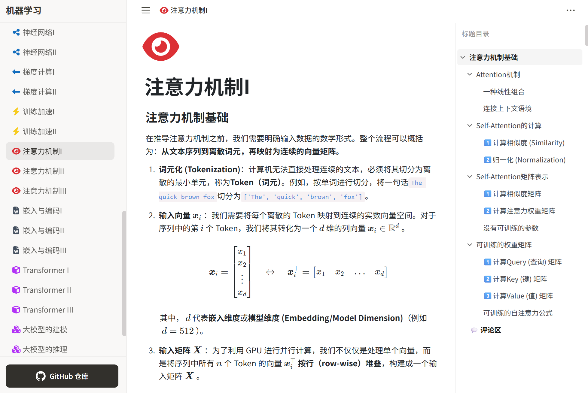

**主要参考来源**

- Xiao Li. **DDA5001 Machine Learning：课程讲义**\[Z/OL]. 2025 秋季学期. 可得自:[https://www.xiao-li.org/teaching/](https://www.xiao-li.org/teaching/?utm_source=chatgpt.com "https://www.xiao-li.org/teaching/")
- Abu-Mostafa, Y. S., Magdon-Ismail, M., Lin, H.-T. **Learning From Data: A Short Course**\[M]. \[United States]: [AMLBook.com](http://AMLBook.com "AMLBook.com"), 2012.
- 姜伟生. **机器学习：全彩图解 + 微课 + Python编程**\[M]. 北京：清华大学出版社，2024.
- Google. **Gemini**\[EB/OL]. 可得自:[https://gemini.google.com/](https://gemini.google.com/?utm_source=chatgpt.com "https://gemini.google.com/")

> 本文档中的部分图片来源于课程讲义、教材、开源资料及网络公开页面。笔者已尽力核实并标注来源，个别图片可能未能准确追溯原始出处。

## 目录

- [机器学习 章节片段](#机器学习-章节片段)
- [线性分类 章节片段](#线性分类-章节片段)
- [误差度量 章节片段](#误差度量-章节片段)
- [梯度下降 章节片段](#梯度下降-章节片段)
- [正则化项 章节片段](#正则化项-章节片段)
- [支持向量机 章节片段](#支持向量机-章节片段)
- [核方法 章节片段](#核方法-章节片段)
- [主成分分析 章节片段](#主成分分析-章节片段)
- [聚类 章节片段](#聚类-章节片段)
- [神经网络 章节片段](#神经网络-章节片段)
- [梯度计算 章节片段](#梯度计算-章节片段)
- [训练加速 章节片段](#训练加速-章节片段)
- [注意力机制 章节片段](#注意力机制-章节片段)
- [嵌入与编码 章节片段](#嵌入与编码-章节片段)
- [Transformer 章节片段](#transformer-章节片段)
- [大语言模型I 章节片段](#大语言模型i-章节片段)
- [大语言模型II 章节片段](#大语言模型ii-章节片段)

#### 机器学习 章节片段

  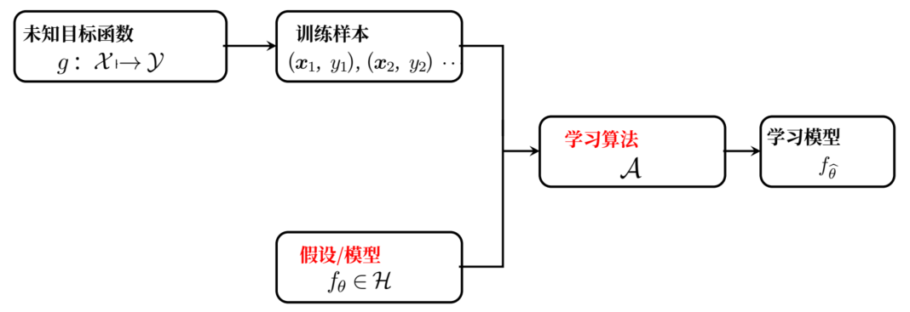

监督学习的整个过程可以描述为：假定在 **输入空间** $\mathcal{X}$ 和 **输出空间** $\mathcal{Y}$ 之间，存在一个我们无法直接获知的、完美的 **目标函数** $g$ 。能利用的仅仅是一个包含 $N$ 个从 $g$ 采样而来的、由 **输入向量** $\boldsymbol{x}\_i$ （ $d$ 个维度）和 **真实标签** $y\_i$ 组成的 **训练数据集** $\mathcal{D}$ 。我们的目标是在一个预先定义的 **假设空间** $\mathcal{H}$ 中，通过学习找到一个由 **参数** $\boldsymbol{\theta}$ 定义的 **模型** $f\_{\boldsymbol{\theta}}$ ，使其能最好地逼近 $g$ 。

$$
f_{\boldsymbol{\theta}} \approx g
$$

具体而言，我们通过一个 **损失函数** $\ell$ 来量化模型 **预测值** $f\_{\boldsymbol{\theta}}(\boldsymbol{x}\_i)$ 与真实值 $y\_i$ 之间的误差，再利用一个 **优化算法** $\mathcal{A}$ 来寻找能使整个数据集上的平均损失最小化的 **最优参数** $\hat{\boldsymbol{\theta}}$ 。

这个过程最终产出的 **学成模型** $f\_{\hat{\boldsymbol{\theta}}}$ ，便是我们对未知规律 $g$ 的最佳近似。

$$
f_{\hat{\boldsymbol{\theta}}} \approx g
$$

那么，当新样本数据（测试数据） $\boldsymbol{x}$ 来时，标签被预测为 $y = f\_{\boldsymbol{\theta}}(\boldsymbol{x})$ 。

#### 线性分类 章节片段

为了理解算法背后的直觉，我们需要先明确权重向量 $\boldsymbol{\theta}$ 的 **几何意义**：

在几何上，方程 $\boldsymbol{\theta}^{\top}\boldsymbol{x} = 0$ 定义了一个超平面（即决策边界）。而权重向量 $\boldsymbol{\theta}$ 正是这个超平面的 **法向量 (Normal Vector)**。以二维分类模型为例，方程 $\boldsymbol{\theta}^{\top}\boldsymbol{x} = 0$ 是一条直线（ $\theta\_{1}x\_{1}+\theta\_{2}x\_{2}+b=0$ ），向量 $\boldsymbol{\theta}$ 的方向必然垂直于这条直线。因此，我们改变 $\boldsymbol{\theta}$ ，本质上是对这条直线的进行旋转。

**几何规律**：一个完美的分类器是怎样的？假设下图呈现的是一个完美的分类器，我们可以发现一个几何规律，对于 **正类样本**，与 $\boldsymbol{\theta}$ 的夹角是锐角；对于 **负类样本**，则与 $\boldsymbol{\theta}$ 的夹角是钝角。

  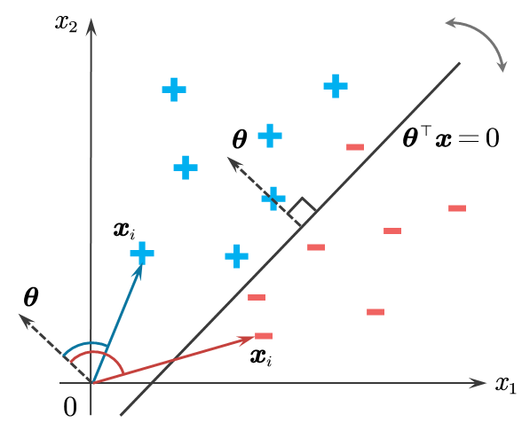

基于这个几何规律，我们希望通过不断调整 $\boldsymbol{\theta}$ 的方向，使其满足以下几何关系：

1. 对于所有 **正类样本**（ $y\_i = +1$ ），我们要让 $\boldsymbol{\theta}$ 与 $\boldsymbol{x}\_i$ 的夹角变为 **锐角**（即方向大致相同），从而保证 $\boldsymbol{\theta}^{\top}\boldsymbol{x}\_i > 0$ 。
2. 对于所有 **负类样本**（ $y\_i = -1$ ），我们要让 $\boldsymbol{\theta}$ 与 $\boldsymbol{x}\_i$ 的夹角变为 **钝角**（即方向大致相反），从而保证 $\boldsymbol{\theta}^{\top}\boldsymbol{x}\_i < 0$ 。

#### 误差度量 章节片段

那么现实中的机器学习是如何学习到"泛化"的呢？下图是一个非常直观的例子。

- **有偏见的抽样 (Biased Sampling)** 只从整个网络的一个特定区域进行采样，并作为训练数据。那么，基于这个有偏见的训练数据，训练出的模型会得出一个荒谬的结论"100%是橙色"。当这个模型被部署到真实的网络中去进行预测时，它会彻底失败。
- **无偏见的抽样 (Unbiased Sampling)** 使用了一个公平的、随机的抽样方法，从网络中的各个部分都抽取了样本。基于这个样本训练出的模型，更有可能学习到关于这个网络"多彩"的真实规律，因此也更有可能在未来的测试中表现良好（泛化）。

  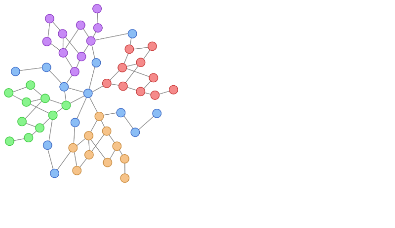

以下图为例，有3个数据点，从假设空间 $\mathcal{H}$ 中取出一个特定的模型 $f\_1$ ，将它应用到这3个点上，得到一个由 $+1$ 和 $-1$ 组成的3元组 $\\{+1,+1,-1\\}$ ，再取出一个特定的模型 $f\_2$ ，应用后得到一个二分法 $\\{-1,-1,+1\\}$ ，同理，取出 $f\_3$ 也得到了一个二分法 $\\{+1,+1,+1\\}$ 。

  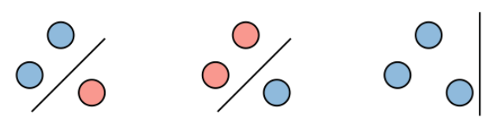

对于3个数据点，一共有8种可能的标记方式。当 $\mathcal{H}$ 强大到能实现这8种二分法，我们就说 $\mathcal{H}$ **打散 (shatter)** 了这3个数据点。

  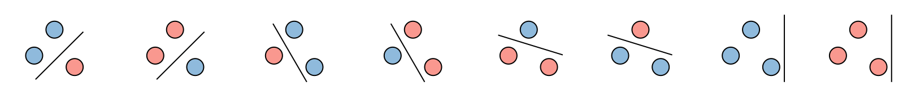

#### 梯度下降 章节片段

  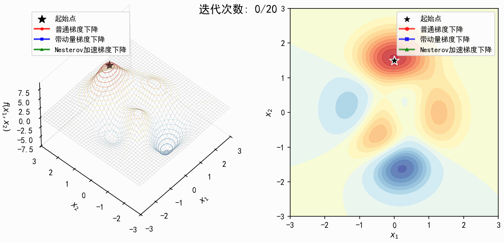

- **普通梯度下降 (红线) - "目光短浅的步行者"**：
  从起点出发后，只移动了非常短的距离就几乎停滞不前，完全没有能力探索到远处的更优点（蓝色深谷）。

$$
\boldsymbol{\theta}_{k+1}=\boldsymbol{\theta}_k-\mu_k\nabla\mathcal{L}(\boldsymbol{\theta}_k)
$$

  它的每一步都完全由当前位置的梯度 $\nabla\mathcal{L}(\boldsymbol{\theta}\_k)$ 决定。因此，走了几步之后，它迅速陷入了一个梯度几乎为零的"平原"或局部极小点。由于没有其他力量的推动，梯度一旦消失，它就失去了前进的动力，因此被困住了。

  这就像一个蒙着眼睛的人在山地里行走，他只能通过脚感受当前地面的坡度来决定下一步。当他走到一块平地上时，他就会因为感受不到任何坡度而停下来，即使不远处就有一个更深的山谷。
- **带动量梯度下降 (蓝线) - "鲁莽的重型卡车"**：
  成功冲出了起点的平缓区，加速冲向了蓝色深谷的最低点。但在巨大的惯性作用下，它始终无法稳定下来，而是在谷底附近大幅度地来回震荡、绕圈。

$$
\boldsymbol{\theta}_{k+1}=\boldsymbol{\theta}_k-\mu_k\nabla\mathcal{L}(\boldsymbol{\theta}_k)+\beta_k(\boldsymbol{\theta}_k-\boldsymbol{\theta}_{k-1})
$$

  其更新方向是当前梯度和上一步移动向量（即动量）的加权和。起点附近，即使梯度小，但只要开始移动，动量项 $\beta\_k(\boldsymbol{\theta}\_k-\boldsymbol{\theta}\_{k-1})$ 就会"记住"之前的移动，推着它继续前进，从而成功穿越平地区域。

  但在冲向蓝色深谷的陡峭下坡路上，梯度方向基本没变。导致动量持续累积，"速度"越来越快。虽然谷底的梯度已经变小甚至反向，但其积累的动量（像刹不住车的卡车）让它直接冲过了头。冲过头后，梯度会把它往回拉。在惯性作用下，它始终无法稳定下来，而是在谷底附近大幅度地来回震荡、绕圈。
- **Nesterov 加速梯度下降 (绿线) - "会预判的赛车手"**：
  和动量法一样，它也成功地冲出了起点。但它在接近最低点时，过冲的幅度明显更小，震荡也更轻微，最终能更快、更稳定地收敛到最低点附近。

$$
\begin{aligned}
&\boldsymbol{w}_k=\boldsymbol{\theta}_k+\beta_k(\boldsymbol{\theta}_k-\boldsymbol{\theta}_{k-1})
\\ &\boldsymbol{\theta}_{k+1}=\boldsymbol{w}_k-\mu_k\nabla\mathcal{L}(\boldsymbol{w}_k)
\end{aligned}
$$

  Nesterov的核心优势在于它的 **"前瞻性"**。它是在一个由动量预测的"未来位置" $\boldsymbol{w}\_k$ 上计算梯度。即它会先"想象"自己按动量冲一步后的位置 $\boldsymbol{w}\_k$ （这个位置已经在对面的山坡上了）。它在那个"未来"的山坡上感受坡度，发现了一个指向谷底的、强烈的反向梯度。这个强烈的"刹车"信号被用来修正最终的移动方向。

  这种"提前刹车"的机制，使得Nesterov能够更有效地抑制过冲和震荡，从而比标准动量法收敛得更快、更稳。这就像一位聪明的赛车手，在入弯前不会等到弯心才刹车，而是会提前预判，在入弯之前就开始减速和调整方向，从而能以更快的速度和更优的路线过弯。

#### 正则化项 章节片段

超参数 $\lambda$ 在这个叠加过程中扮演着"权重"的角色，它决定了正则项函数曲面的陡峭程度。

- **对于L2正则化**：随着 $\lambda$ 增大，圆形碗变得越来越陡峭，其对原点的"引力"越来越强，迫使最终解（**黄色X**）沿着一条平滑的轨迹从 **红色X** 向 **原点** 移动。
- **对于L1正则化**：随着 $\lambda$ 增大，"倒金字塔"变得越来越陡峭，坐标轴上的"山谷"也越来越深。这使得解更容易"滑入"并停留在某些坐标轴上，从而增强了模型的稀疏性。

因此，通过调整 $\lambda$ ，我们可以在"完全相信数据"（OLS解）和"参数收缩"（或稀疏）这两个极端之间，灵活地控制模型的最终形态。

下面的动画展示了随着正则化参数 $\lambda$ 不断增大，最优解（**黄色X**）位置的变化。左图对应 **L2正则化**，右图对应 **L1正则化**。

  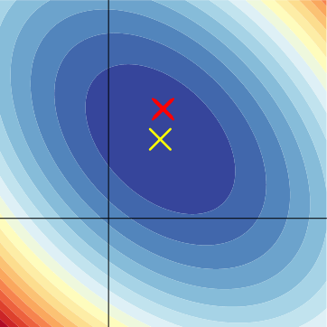

  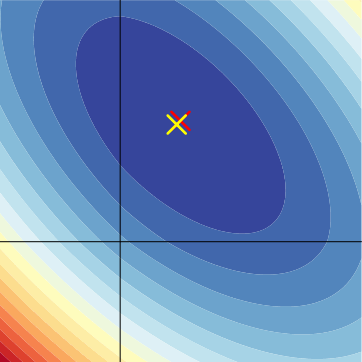

因此，从函数叠加的视角看，L2正则化像一个光滑的引力场，将解均匀地拉向原点，实现 **参数收缩**；而L1正则化则像一个带有特定路径（坐标轴上的"山谷"）的引力场，倾向于将解"拽"到坐标轴上，从而实现 **稀疏化和特征选择**。

#### 支持向量机 章节片段

一个合格的超平面可以有无数个，但我们的目标是找到 **最好** 的那一个。SVM认为，最好的超平面是那个能为两类数据点提供最大"缓冲地带"的平面。这个缓冲地带就叫做 **间隔 (Margin)**。

  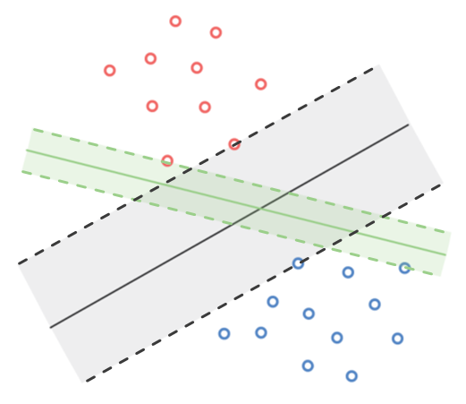

如图所示，间隔是由两条平行于决策边界的虚线所界定的区域。而这两条虚线，恰好穿过了距离决策边界最近的那些数据点。这些最靠近决策边界、并"支撑"起整个间隔区域的关键数据点，被称为 **支持向量 (Support Vectors)**。例如，下图中被黑色圆圈住的数据点，它们是整个模型构建中最核心的样本。

  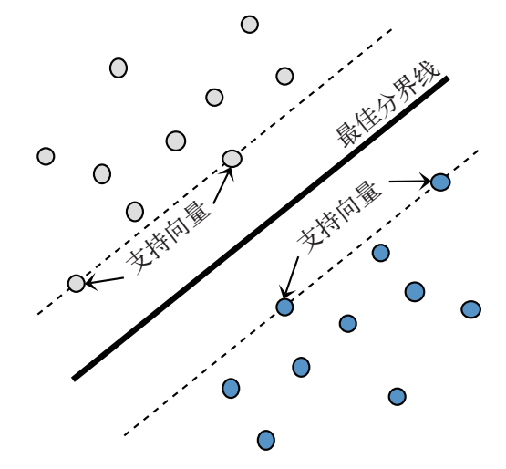

#### 核方法 章节片段

既然在当前的维度（例如 $d$ 维）下我们找不到一个线性的解，那么我们是否可以换一个"视角"来看待数据？

这里的核心思想是：**将数据从原始的低维空间** $\mathbb{R}^d$ **映射到一个更高维的空间** $\mathbb{R}^p$ **（其中** $p > d$ **），并期望数据在这个高维空间中变得线性可分**。

  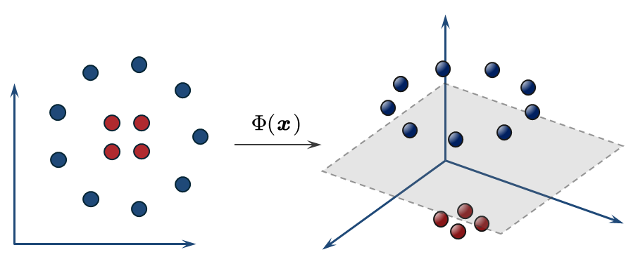

例如，在二维平面上（ $d=2$ ）的同心圆数据。我们引入一个非线性变换 $\Phi$ ，将其映射到三维空间（ $p=3$ ）。这个变换 $\Phi$ 可能是：

$$
\Phi(\boldsymbol{x}) = \Phi(\begin{pmatrix} x_1 \\ x_2 \end{pmatrix}) = \begin{pmatrix} x_1 \\ x_2 \\ x_1^2 + x_2^2 \end{pmatrix} = \boldsymbol{z}
$$

- **效果：** 原始数据中的点 $\boldsymbol{x}$ 被转换为了新的点 $\boldsymbol{z}$ 。如果原点在同心圆的中心位置，那么：
  - 内圈的红点（ $x\_1^2 + x\_2^2$ 较小）会被映射到三维空间中一个"碗"的底部。
  - 外圈的绿点（ $x\_1^2 + x\_2^2$ 较大）会被映射到这个"碗"的边缘，处于较高的位置。
- **结果**：在这个新的三维 $\mathcal{Z}$ 空间中，我们现在可以轻易地用一个 **水平的平面**（这是一个线性模型！）将这两类数据分开。

#### 主成分分析 章节片段

在深入研究PCA的数学模型之前，建立一个强大的几何直觉至关重要。PCA的核心问题是：我们如何将一个在高维空间（例如1000维）中分布的复杂"数据点"，用一个更简单、更低维度的"形状"来近似表示，同时尽可能多地保留其"本质"信息？

对于PCA来说，这个"更简单的形状"被严格限制为 **线性** 的：即一条直线（1D）、一个平面（2D）或一个"超平面"（k维）。

  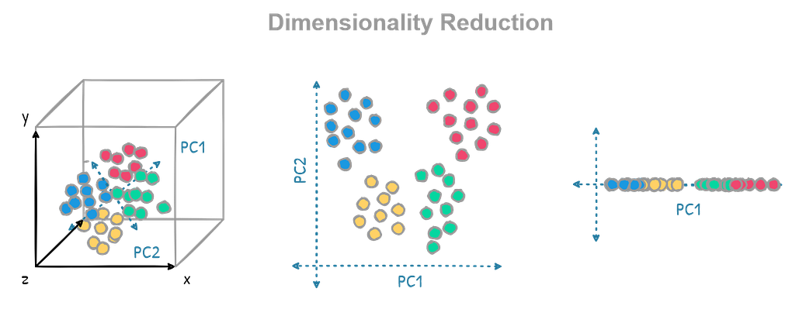

让我们从最简单的情况开始。假设我们的数据是2D空间（一个平面）中的一团数据点（数据中心为原点）。我们的目标是将其降维到1D，即找到一条 **直线** 来最佳地代表这团数据点。

假设我们任意 **选择** 了一条穿过数据中心的直线 $U$ 。对于这团数据点中的 **任何一个** 原始数据点 $\boldsymbol{x}$ （以红色'x'表示，它不在直线上），这条直线上的哪一个点是重建点 $\hat{\boldsymbol{x}}$ 呢？

我们可以在直线 $U$ 上选择无数个"候选重建点" $\tilde{\boldsymbol{x}}$ 。它代表了我们"压扁" $\boldsymbol{x}$ 后的一种可能性。

  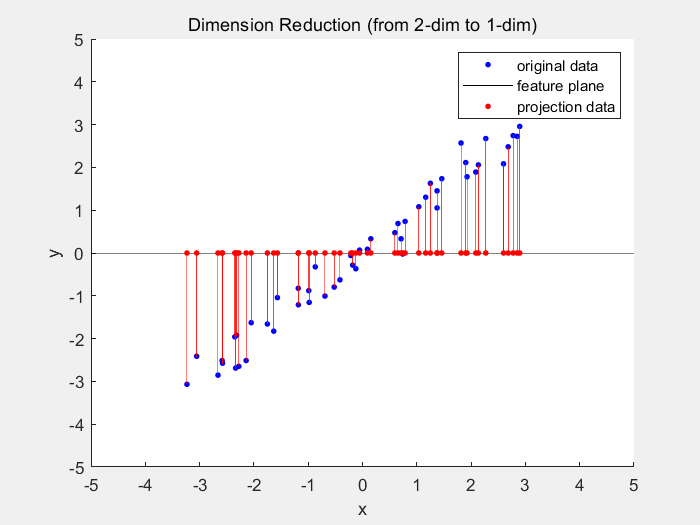

#### 聚类 章节片段

在机器学习中，我们处理的第一步是获取数据。聚类任务的起点是给定一组 **无标签 (unlabeled)** 的数据样本，表示为 $\boldsymbol{x}\_1, \boldsymbol{x}\_2, \dots, \boldsymbol{x}\_n$ 。

这里的关键点在于"无标签"。这意味着我们只有数据点本身，没有任何关于它们"应该"属于哪个类别的信息。每一个数据样本 $\boldsymbol{x}\_i$ 都是一个 $d$ 维的向量，即 $\boldsymbol{x}\_i \in \mathbb{R}^d$ ，表示每个样本由 $d$ 个特征描述。

> 🔺聚类（Clustering）的核心任务是，将这些无标签的数据点分配到若干个 **不相交（disjoint）** 的子集中，这些子集被称为 **簇（clusters）**。

这个分配过程遵循一个核心 **原则**：隶属于 **同一个簇** 的数据点彼此之间应该 **高度相似**，而隶属于 **不同簇** 的数据点彼此之间应该 **高度相异**。"相似"与"相异"是相对的概念，我们通过距离或相似度函数来量化。

  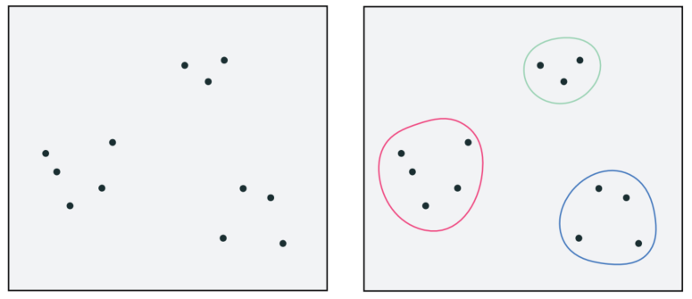

#### 神经网络 章节片段

现在，我们进行真正的飞跃：在输入层和输出层之间插入一个或多个 **隐藏层 (Hidden Layers)**。这就是我们通常所说的 **多层神经网络 (Multi-layer Neural Network, MLP)**。

**核心思想**：我们不再让输出层直接处理原始输入 $\boldsymbol{x}$ 。而是先让 $\boldsymbol{x}$ 通过一个非线性变换，生成一组新的、更高级的"中间特征" $\boldsymbol{z}$ ，然后再让输出层来处理 $\boldsymbol{z}$ 。

1. 先从 $\boldsymbol{x}$ 映射到 $\boldsymbol{z}$ 。
2. 再从 $\boldsymbol{z}$ 映射到 $\boldsymbol{y}$ 。

将整个计算过程用图片表示：

  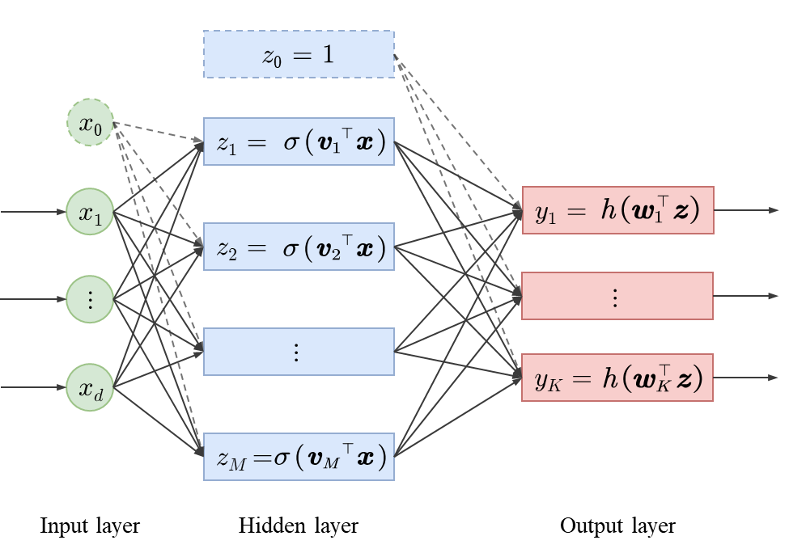

现在我们来看每一个神经元（节点）的计算过程：

**步骤1：从输入层到隐藏层**（ $\boldsymbol{x} \to \boldsymbol{z}$ ）

这一步本身就是一个"输入层-输出层"的网络，只不过它的"输出"是我们称为"隐藏特征"的 $\boldsymbol{z}$ 。

第 $m$ 个隐藏单元 $z\_m$ （ $m=1, \dots, M$ ）的计算为：

$$
z_m = \sigma \left( \sum_{i=0}^{d} v_{mi} x_i \right) = \sigma(\boldsymbol{v}_m^\top \boldsymbol{x})
$$

- $\boldsymbol{v}\_m$ 是一个 $(d+1) \times 1$ 的权重向量，它包含了从 **所有** 输入单元（包括偏置 $x\_0$ ）连接到 **这一个** 隐藏单元 $z\_m$ 的所有权重。
- $\sigma(\cdot)$ 是隐藏层激活函数。 $\sigma$ **必须是非线性的**（例如Sigmoid, Tanh，或ReLU函数）。如果 $\sigma$ 是线性的，那么整个两层网络在数学上可以被简化成一个单层网络，从而失去拟合复杂非线性关系的能力。

这个过程 $\boldsymbol{x} \rightarrow \boldsymbol{z}$ 可以被看作是：我们同时训练了 $M$ 个不同的单层模型，并将它们的输出 $z\_m$ （即提取到的特征）汇集起来，作为下一阶段的输入。

#### 梯度计算 章节片段

给定一个 $L$ 层的深度前馈网络，其输入为 $\boldsymbol{x} \in \mathbb{R}^d$ ，其数学表达式可以写成一种高度嵌套的复合函数：

$$
f_{\boldsymbol{\theta}}(\boldsymbol{x}) = h\left(\boldsymbol{W}^L \sigma\left(\boldsymbol{W}^{L-1} \dots \sigma\left(\boldsymbol{W}^2 \sigma(\boldsymbol{W}^1 \boldsymbol{x})\right) \dots\right)\right)
$$

  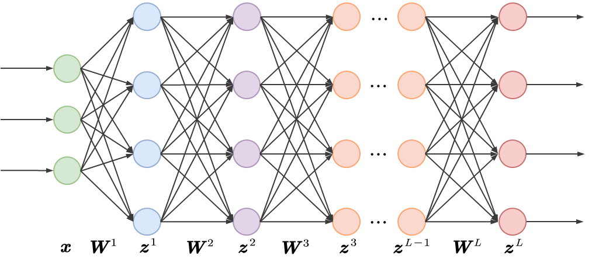

我们可以把这个过程的矩阵表示进一步展开：

  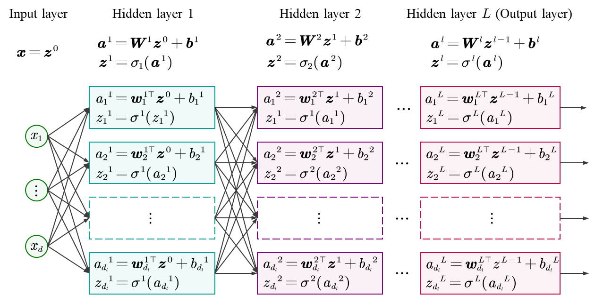

#### 训练加速 章节片段

下面是一个使用MBGD的标准训练流程（以监督学习为例）的详细分解：

1. **初始化**

   确定模型 $\boldsymbol{f}$ （由 $\boldsymbol{\theta}$ 参数化），选择损失函数 $\ell\_i$ ，设定超参数（如学习率 $\mu$ 、批量大小 $b=128$ 、总训练轮数 $E\_{\text{max}}=50$ ）。
2. **训练外循环（按Epoch进行）**

   `for e in 1 to E_max:`（例如，从第1轮到第50轮）
3. **随机重排 (Shuffle)**

   在 **每一轮 (Epoch) 开始时**，必须对整个训练集（ $n=1,000,000$ 个数据）进行 **彻底的随机重排**。

   这是为了打破数据在存储或采集时可能存在的固有顺序或相关性。通过重排，我们确保了在下一步划分批次时，每个Mini-Batch都是对整个数据集的近似 **独立同分布 (i.i.d.)** 的采样。这保证了 $\boldsymbol{g}\_k$ 是真实梯度 $\nabla \mathcal{L}(\boldsymbol{\theta})$ 的无偏估计，是MBGD有效性的理论基石。
4. **训练内循环（按Iteration进行）**：

   将重排后的 $n$ 个数据，按顺序切割成 $N\_b=7813$ 个批次（ $\mathcal{B}\_1, \mathcal{B}\_2, ..., \mathcal{B}\_{7813}$ ）。
   `for k in 1 to N_b:`（例如，从第1批到第7813批）
   - **A. 抽取批次：** 获取第 $k$ 个小批量 $\mathcal{B}\_k$ （包含 $b=128$ 个数据点，或最后一个批次 $|\mathcal{B}\_{N\_b}| \le 128$ 个）。
   - **B. 前向传播：** 模型在 $\mathcal{B}\_k$ 的每个样本上计算预测值。
   - **C. 计算损失：** 计算 $\mathcal{B}\_k$ 上每个样本的损失 $\ell\_i(\boldsymbol{\theta}\_k)$ 。
   - **D. 反向传播：** 计算这个批次的 **平均梯度** $\boldsymbol{g}\_k = \frac{1}{|\mathcal{B}\_k|} \sum\_{i \in \mathcal{B}\_k} \nabla \ell\_i(\boldsymbol{\theta}\_k)$ 。
   - **E. 参数更新：** 执行 **一次迭代**，更新模型参数：

$$
\boldsymbol{\theta}_{k+1} \leftarrow \boldsymbol{\theta}_k - \mu_k \boldsymbol{g}_k
$$
5. **一轮 (Epoch) 结束**

   当内循环（步骤4）完成 $N\_b=7813$ 次迭代后，模型已经看完了所有数据一次，一个Epoch结束。此时，模型的参数已经被更新了7813次。
6. **验证与评估**

   在一个Epoch结束后，标准做法是：**在独立的验证集 (Validation Set) 上评估模型当前的性能**（例如，计算验证集上的损失或准确率）。
   - **目的：** 监控模型是否出现 **过拟合**。
   - **决策：** 这一步的结果用于调整学习率、执行"早停" (Early Stopping，即如果验证性能不再提升则停止训练) 等。
7. **重复**

   算法返回步骤2（或步骤3，如果 $e < E\_{\text{max}}$ ），开始新一轮的Epoch（再次重排、再次迭代...），直到达到收敛标准（例如，完成 $E\_{\text{max}}$ 轮，或验证损失连续多轮不再下降）。

这个" **重排(Shuffle) → 迭代(Iterate) → 评估(Validate)** "的循环，构成了现代机器学习项目训练阶段的精确蓝图。

  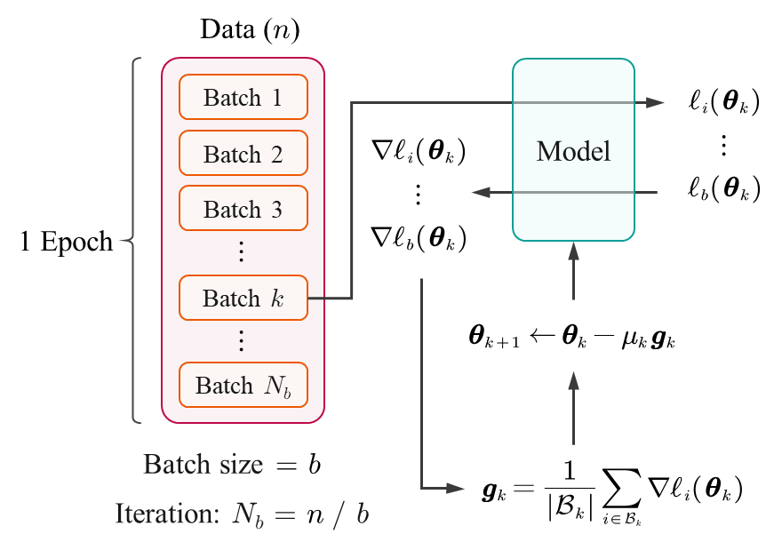

#### 注意力机制 章节片段

注意力机制：从矩阵（一整个序列）的角度：

$$
\boldsymbol{Q} = \boldsymbol{X}\boldsymbol{W}^{(Q)}, \quad \boldsymbol{K} = \boldsymbol{X}\boldsymbol{W}^{(K)}, \quad \boldsymbol{V} = \boldsymbol{X}\boldsymbol{W}^{(V)}
$$

$$
\boldsymbol{Y} = \text{Attention}(\boldsymbol{Q}, \boldsymbol{K}, \boldsymbol{V}) = \text{softmax}\left(\frac{\boldsymbol{Q} \boldsymbol{K}^\top}{\sqrt{d_k}}\right) \boldsymbol{V}
$$

  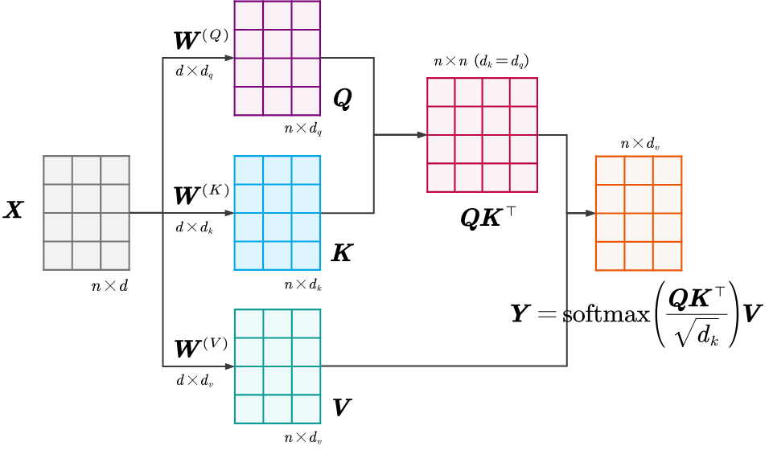

多头注意力机制：Attention 就像拥有了"复眼"，能够同时从多个维度（语法、语义、指代、韵律等）去观察和理解输入序列，极大地增强了模型的表达能力。

多头注意力的完整数学描述如下：

$$
\boldsymbol{Q}_h = \boldsymbol{X}\boldsymbol{W}_h^{(Q)}, \quad \boldsymbol{K}_h = \boldsymbol{X}\boldsymbol{W}_h^{(K)}, \quad \boldsymbol{V}_h = \boldsymbol{X}\boldsymbol{W}_h^{(V)}
$$

$$
\boldsymbol{H}_h = \text{Attention}(\boldsymbol{Q}_h, \boldsymbol{K}_h, \boldsymbol{V}_h) = \text{softmax}\left(\frac{\boldsymbol{Q}_h \boldsymbol{K}_h^\top}{\sqrt{d_k}}\right) \boldsymbol{V}_h
$$

$$
\boldsymbol{Y}= \text{Concat}(\boldsymbol{H}_1, \dots, \boldsymbol{H}_H)\boldsymbol{W}^{(O)}
$$

  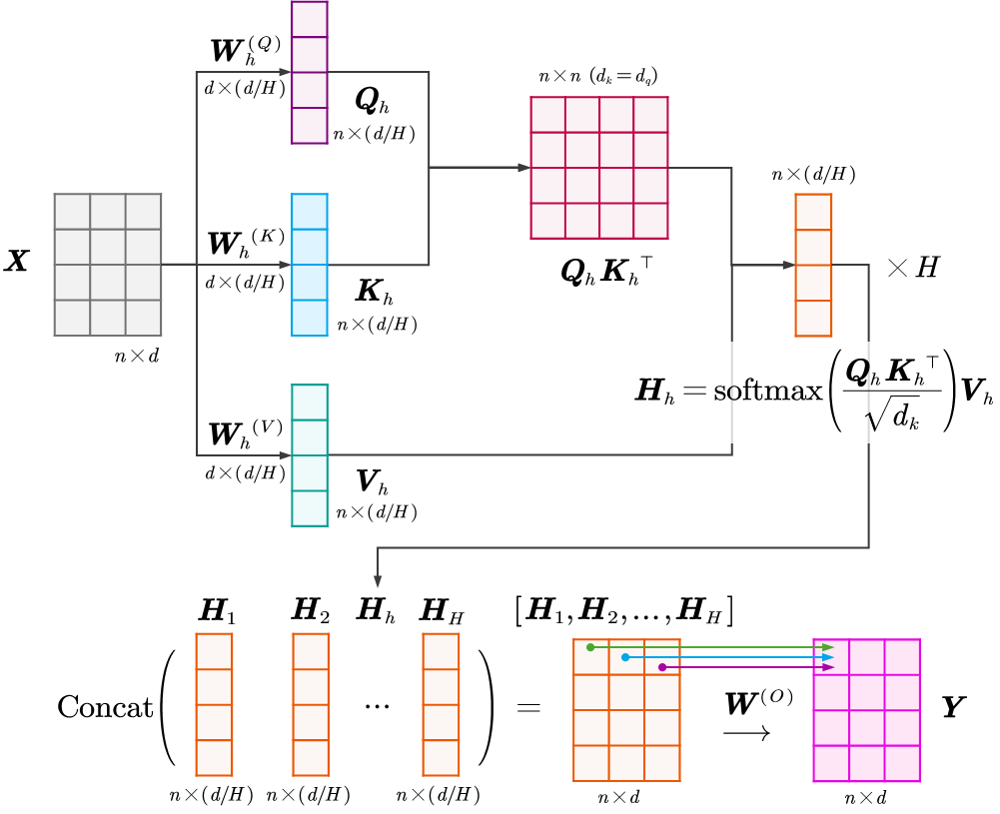

#### 嵌入与编码 章节片段

计算机无法直接处理连续的现实世界信息（如一句话、一张图），必须先将其 **离散化/词元化** (Tokenization)，也就是切分为离散的最小单元，这个单元就是 **Token（词元）**。

  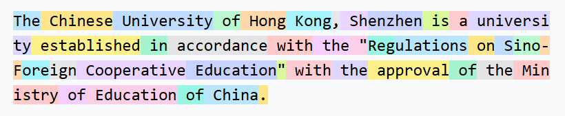

正弦位置编码 (SPE) 的做法是：**读取每个时钟指针在时刻** $i$ **的坐标，组成一个独立的位置向量，然后加到语义向量上**。

  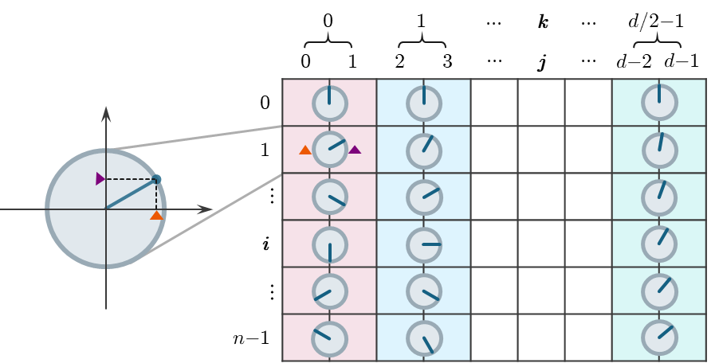

旋转位置编码 (RoPE) 的做法是：**将语义向量本身进行分组，把每一组看作一个二维向量，然后用对应时钟的角度来旋转这个二维向量**。

  

#### Transformer 章节片段

然后将这些Decoder Block进行堆叠，我们可以得到Transformer的解码器（Decoder）部分。

  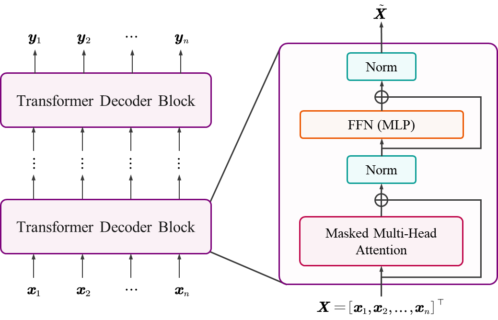

以Llama 3为例，其提供了 **8B、70B、405B** 三种不同参数量的版本，以适应不同应用场景。

- **8B模型**：堆叠32层，模型维度（Model Dimension, 嵌入维度）为4,096。这是标准的轻量级配置，适合消费级显卡部署。
- **70B模型**：堆叠80层，模型维度翻倍至8,192。这是平衡性能与成本的主力模型。
- **405B模型**：堆叠126层，模型维度高达16,384。作为旗舰模型，其深度和宽度的增加极大地提升了模型的抽象推理能力和知识容量。

#### 大语言模型I 章节片段

现在，我们来看模型输出的概率矩阵 $\boldsymbol{P}$ 如何与需要预测的目标序列 $\boldsymbol{Y}$ 对应：

$$
\begin{array}{rcccc}
\text{Input } \boldsymbol{X}: & \texttt{(start)} & \texttt{I} & \texttt{love} & \texttt{CUHKSZ} \\
& \downarrow & \downarrow & \downarrow & \downarrow & \text{(Decoder)}\\
\text{Hidden State } \boldsymbol{Z}: & \boldsymbol{z}_1 & \boldsymbol{z}_2 & \boldsymbol{z}_3 & \boldsymbol{z}_4 \\
& \downarrow  & \downarrow & \downarrow & \downarrow & \text{(LM Head + Softmax)}\\
\text{Probability } \boldsymbol{P}: & \boldsymbol{p}_1 & \boldsymbol{p}_2 & \boldsymbol{p}_3 & \boldsymbol{p}_4 \\
& \updownarrow  & \updownarrow & \updownarrow & \updownarrow & \text{(Compare)} \\
\text{Target } \boldsymbol{Y}: & \color{red}{\texttt{I}} & \color{blue}{\texttt{love}} & \color{green}{\texttt{CUHKSZ}} & \color{purple}{\texttt{<end>}}
\end{array}
$$

得益于Decoder中的因果掩码，模型可以在一次前向传播中并行地计算所有位置的下一个词的概率分布 $\boldsymbol{P} = [\boldsymbol{p}\_1, \boldsymbol{p}\_2, \dots, \boldsymbol{p}\_m]$ 。

- $\boldsymbol{z}\_1$ 是基于输入 `[<start>]` 得到的隐藏态。最终输出的概率分布向量 $\boldsymbol{p}\_1$ 用于预测第一个词（目标是 $\color{red}{\texttt{I}}$ ）。
- $\boldsymbol{z}\_2$ 是基于输入 `[<start>, I]` 得到的隐藏态（因果掩码确保了这一点）。最终输出 $\boldsymbol{p}\_2$ 用于预测第二个词（目标是 $\color{blue}{\texttt{love}}$ ）。
- $\boldsymbol{z}\_3$ 是基于输入 `[<start>, I, love]` 得到的隐藏态。最终输出 $\boldsymbol{p}\_3$ 用于预测第三个词（目标是 $\color{green}{\texttt{CUHKSZ}}$ ）。
- $\boldsymbol{z}\_4$ 是基于输入 `[<start>, I, love, CUHKSZ]` 得到的隐藏态。最终输出 $\boldsymbol{p}\_4$ 用于预测第四个词（目标是 $\color{purple}{\texttt{<end>}}$ ）。

这个过程总结为，**对于原始输入序列中的第** $i$ **个 Token** $\boldsymbol{x}\_i$ **，模型利用输入序列中前** $i$ **个Token的信息，层层加工，得到新的特征向量** $\boldsymbol{z}\_i$ **，然后在输出层生成词表的概率分布** $\boldsymbol{p}\_i$ **，用于预测第** $i+1$ **个Token**。

这就是所谓的 **Next-Token Prediction**。Transformer通过这种方式，在一次前向传播中并行地计算了序列中所有位置的下一个词的概率。

  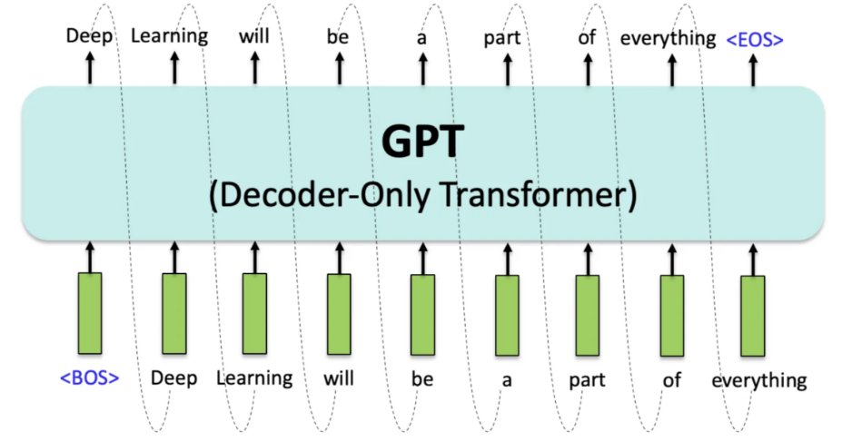

#### 大语言模型II 章节片段

在训练大型语言模型（LLM）时，监督微调（Supervised Fine-Tuning, SFT）是关键步骤。

SFT 与预训练最大的区别在于 **数据结构** 的变化。预训练关注无监督的文本流，而 SFT 则聚焦于结构化的 **"指令-回复"数据对**。

在现代深度学习（尤其是LLM）中，绝大多数训练目标本质上都是在做 **"最大似然估计"**（即最小化负对数似然）。在"大模型的建模"章节里，我们总结一个"最小化负对数似然函数"的模版，并成功得到了监督微调阶段的优化目标。

这里，我们使用一个更加"原始"的模版，所有基于最大似然估计的损失函数都可以写作：

$$
\color{red}{\mathcal{L}(\text{模型参数}) = - \mathbb{E}_{\text{数据} \sim \mathcal{D}} \log (\text{模型预测"正确事件"发生的概率})}
$$

那么，SFT的目标是最大化模型生成训练集中目标回答的概率，其损失函数可以写为：

$$
\mathcal{L}_{\text{SFT}}(\boldsymbol{\theta}) = - \mathbb{E}_{(\boldsymbol{x}, \boldsymbol{y}) \sim \mathcal{D}_{\text{SFT}}} [\log \boldsymbol{\pi}_{\boldsymbol{\theta}}(\boldsymbol{y}|\boldsymbol{x})]
$$

......

我们发现，难以计算的函数项 $\beta \log Z(\boldsymbol{x})$ 在相减时被完美地抵消了！

我们把这个结果代入到BT模型中。模型预测" $\boldsymbol{y}\_w$ 优于 $\boldsymbol{y}\_l$ "的概率就变成了：

$$
\begin{aligned}
\mathbb{P}_{\boldsymbol{\theta}}(\boldsymbol{y}_w \succ \boldsymbol{y}_l | \boldsymbol{x}) &= \sigma(r_{\boldsymbol{\theta}}(\boldsymbol{x}, \boldsymbol{y}_w) - r_{\boldsymbol{\theta}}(\boldsymbol{x}, \boldsymbol{y}_l)) \\
&= \sigma \left( \beta \log \frac{\boldsymbol{\pi}_{\boldsymbol{\theta}}(\boldsymbol{y}_w|\boldsymbol{x})}{\boldsymbol{\pi}_{\text{ref}}(\boldsymbol{y}_w|\boldsymbol{x})} - \beta \log \frac{\boldsymbol{\pi}_{\boldsymbol{\theta}}(\boldsymbol{y}_l|\boldsymbol{x})}{\boldsymbol{\pi}_{\text{ref}}(\boldsymbol{y}_l|\boldsymbol{x})} \right)
\end{aligned}
$$

我们希望"胜者胜出"（正确事件）的概率越大越好，套用我们之前的最大似然估计（MLE）模版：

$$
\color{red}{\mathcal{L}(\text{模型参数}) = - \mathbb{E}_{\text{数据} \sim \mathcal{D}} \log (\text{模型预测"正确事件"发生的概率})}
$$

我们就得到了DPO最终的损失函数：

$$
\mathcal{L}_{\text{DPO}}(\boldsymbol{\theta}) = - \mathbb{E}_{(\boldsymbol{x}, \boldsymbol{y}_w, \boldsymbol{y}_l) \sim \mathcal{D}} \left[ \log \sigma \left( \beta \log \frac{\boldsymbol{\pi}_{\boldsymbol{\theta}}(\boldsymbol{y}_w|\boldsymbol{x})}{\boldsymbol{\pi}_{\text{ref}}(\boldsymbol{y}_w|\boldsymbol{x})} - \beta \log \frac{\boldsymbol{\pi}_{\boldsymbol{\theta}}(\boldsymbol{y}_l|\boldsymbol{x})}{\boldsymbol{\pi}_{\text{ref}}(\boldsymbol{y}_l|\boldsymbol{x})} \right) \right]
$$

因此，PPO的本质就是把训练策略模型 $\boldsymbol{\pi}\_{\boldsymbol{\theta}}$ 当成奖励模型（裁判）来训练，让LLM学会和奖励模型一样，学会给那些符合人类偏好的回答打高分。我们知道训练奖励模型就是监督学习的过程，因此，在训练上这完全摆脱了强化学习复杂的流程。

在 **优化过程** 中，它被降维成了一个标准的 **监督学习任务**。我们不需要处理强化学习中复杂的采样（Sampling）、探索（Exploration）或价值估计（Value Estimation），只需要像训练分类器一样，喂入数据对，计算梯度，更新参数即可。
